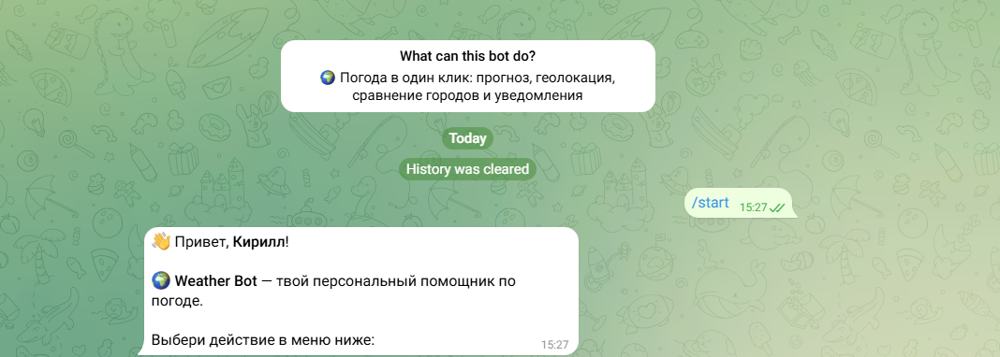
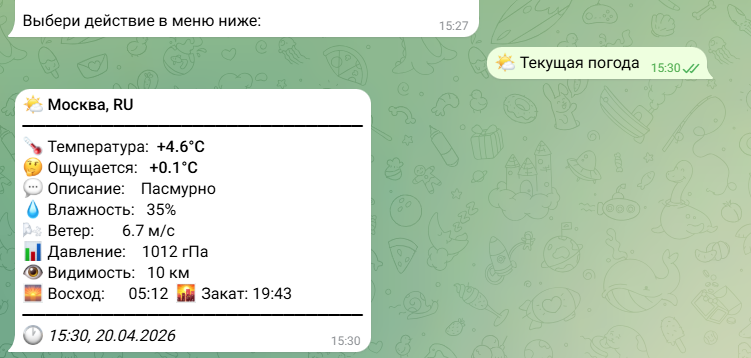
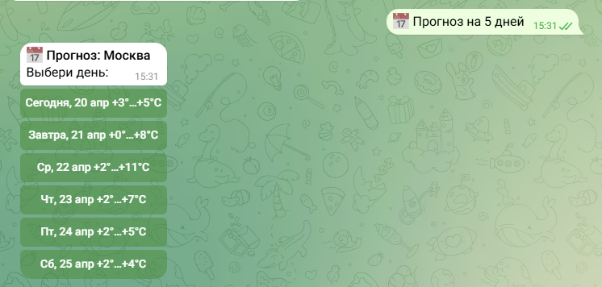
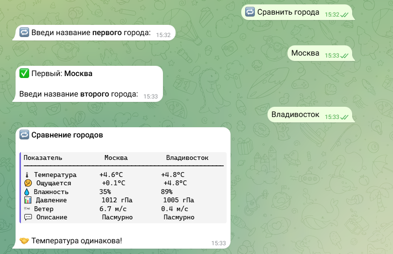
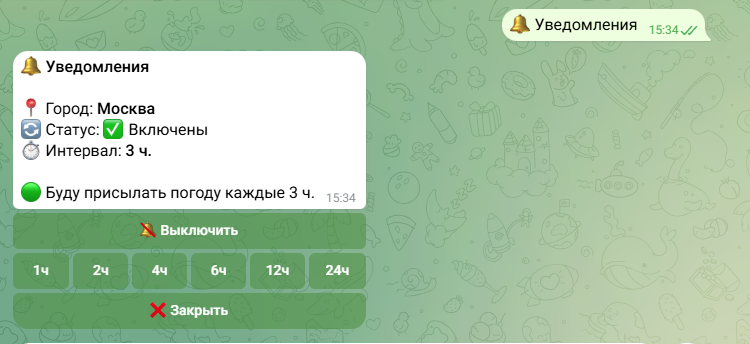

# 🌦 Weather CLI & Telegram Bot

Многофункциональное приложение для получения погоды, объединяющее **CLI-интерфейс** и **Telegram-бота** с расширенными возможностями.

Проект демонстрирует работу с внешними API, обработку ошибок, UX в CLI и чат-интерфейсе, а также хранение состояния пользователей.

---

## ✨ Основные возможности

### 💻 CLI-приложение

* 📍 Поиск погоды по городу
* 🌐 Поиск по координатам (lat/lon)
* 🌡 Температура, ощущается как, влажность, ветер
* ♻️ Локальное кеширование (TTL: 3 часа)
* 🔁 Повторные попытки при сетевых ошибках
* ⚠️ Обработка ошибок (API, сеть, ввод пользователя)

---

### 🤖 Telegram-бот

Полноценный пользовательский интерфейс внутри Telegram:

* 🌤 **Текущая погода**
* 📅 **Прогноз на 5 дней** (с интерактивным выбором дня)
* 📍 **Погода по геолокации**
* 🔁 **Сравнение городов**
* 🔬 **Расширенные данные** (включая качество воздуха)
* 🔔 **Уведомления** (с настраиваемым интервалом)
* ⚡ **Inline-режим** (поиск прямо в строке ввода Telegram)

---

## 🧪 Демонстрация

### CLI


---

### 🤖 Telegram Bot







---

## 🏗 Архитектура проекта

```
CLI (weather_app.py)
        │
        ▼
OpenWeather API
        ▲
        │
Telegram Bot (bot.py)
        │
        ▼
User Storage (storage.py)
```

### Особенности архитектуры:

* переиспользование логики (`weather_app.py`) между CLI и ботом
* разделение ответственности (API / UI / storage)
* централизованная работа с погодными данными

---

## ⚙️ Технологии

* Python 3.8+
* OpenWeather API
* python-telegram-bot
* requests
* python-dotenv

---

## 📦 Установка

```bash
git clone https://github.com/KirillTomenko/openweather-cli.git
cd openweather-cli

python -m venv venv
source venv/bin/activate  # Linux / Mac
venv\Scripts\activate     # Windows

pip install -r requirements.txt
```

---

## 🔑 Настройка

Создайте файл `.env`:

```env
API_KEY=your_openweather_api_key
BOT_TOKEN=your_telegram_bot_token
```

---

## ▶️ Запуск

### CLI

```bash
python weather_app.py
```

---

### Telegram-бот

```bash
python bot.py
```

---

## 💬 Примеры использования

### CLI

```bash
Введите город: Москва

Температура: +18°C
Ощущается: +16°C
Погода: облачно
```

---

### Telegram

* `/start` — запуск бота
* Использование кнопок меню
* Inline режим:

```
@your_bot_name London
```

---

## 🧠 Ключевые технические решения

* **Кеширование**

  * хранение в JSON (`weather_cache.json`)
  * fallback при недоступности API

* **Обработка ошибок**

  * retry при сетевых сбоях
  * защита от некорректного ввода

* **Telegram UX**

  * ReplyKeyboard + InlineKeyboard
  * ConversationHandler для сценариев
  * JobQueue для уведомлений

* **Хранение состояния**

  * сохранение города пользователя
  * настройка уведомлений

---

## 📁 Структура проекта

```
.
├── weather_app.py      # CLI + API логика
├── bot.py              # Telegram-бот
├── storage.py          # работа с пользователями
├── weather_cache.json  # кеш
├── .env                # конфигурация
└── assets/             # скриншоты
```

---

## 🚧 Планы развития

* [ ] Docker-контейнеризация
* [ ] Web-интерфейс
* [ ] История запросов
* [ ] Поддержка нескольких языков
* [ ] Unit-тесты

---

## 📌 О проекте

Проект создан как демонстрация:

* работы с REST API
* проектирования CLI и чат-интерфейсов
* обработки ошибок и отказоустойчивости
* организации кода в реальном приложении

---

## 📄 Лицензия

MIT
