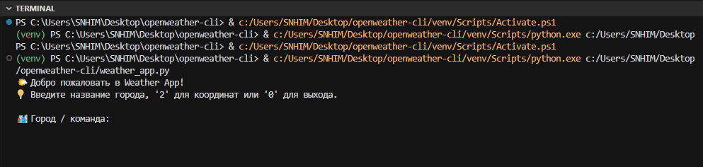
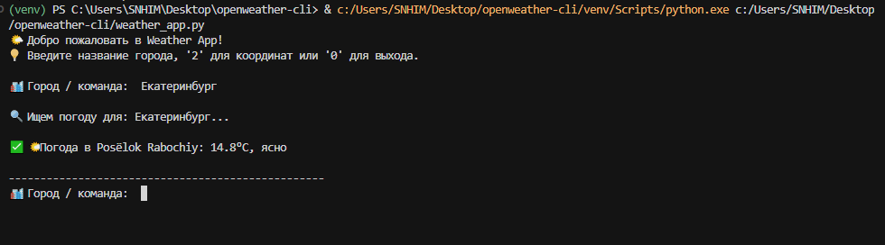
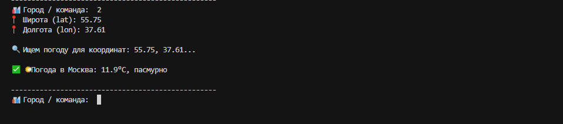

@'
# 🌤️ Weather CLI

Приложение командной строки для получения текущей погоды через [OpenWeather API](https://openweathermap.org/api).


## ✨ Возможности

- 🔍 Поиск погоды по названию города или координатам
- 🌐 Поддержка русского языка и градусов Цельсия
- 💾 Локальное кэширование (до 3 часов)
- 🔄 Автоматические ретраи при сетевых ошибках
- 🔐 Безопасное хранение API-ключа через `.env`
- 🎯 Понятные сообщения об ошибках

## 📸 Демонстрация

### Интерфейс


### Пример использования


### Поиск по координатам


### Обработка ошибок


## 🚀 Быстрый старт

### 1. Клонирование
```bash
git clone https://github.com/KirillTomenko/openweather-cli.git
cd openweather-cli